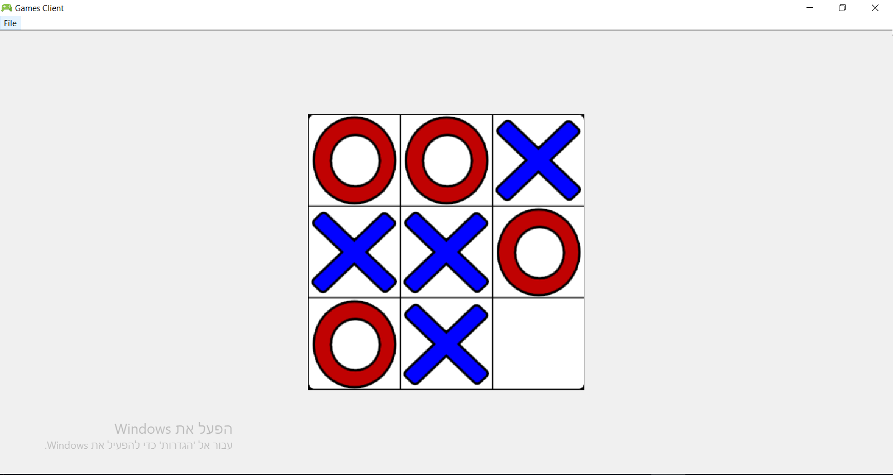
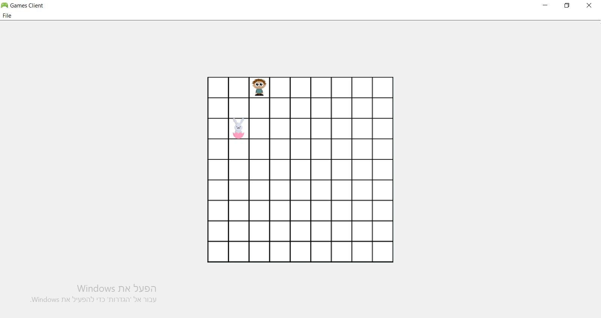

# Games Implementation clien/server (sockets)
Java project which represent 2 games for a single player - "Tic Tac Toe" & "Catch the bunny"  
The project devided into 3 parts - "Games AI logic", "Server Side Implementation" and "Client Side".  
It also emphasizes the use of Design Patterns and MVC architecture. 

 

